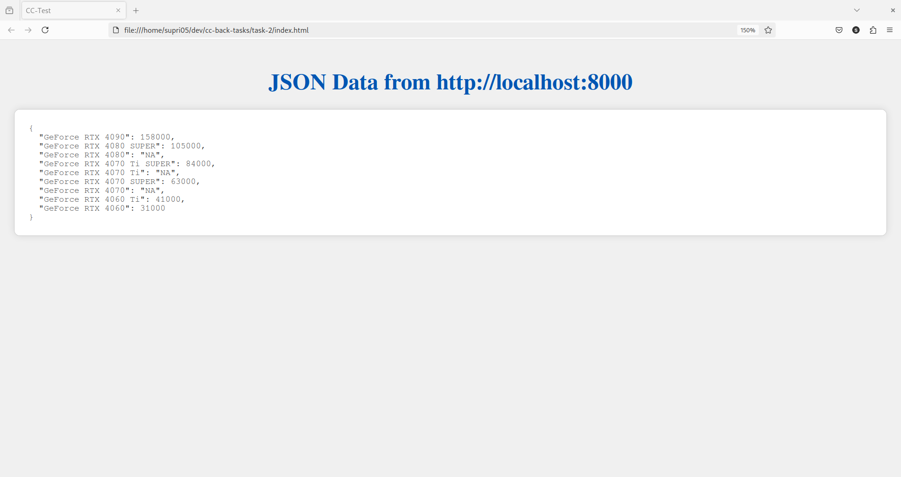

# Web scraping using javascript

This is a simple program written in javascript that scrapes the information related to different GPU's and their prices from the [nvidia](https://www.nvidia.com/en-in/geforce/buy/) 
website and serves it as a map of product names and their prices ("NA") if no price mentioned from a locally hosted server on port 8000 (Default)

# Example

## Description
Uses the selenium webdriver for scraping the data and express.js for making a local server

## Requirements
1. nodejs and npm
2. web-driver for the browser you intend to use (check `Usage` for info on this)

## Usage
1. Clone the repository
2. run `npm i`
3. run `npm run start-server` or `node src/app.js`
4. Visit [`index.html`](index.html) through your browser or visit `localhost:8000` to view the results

if no options provided, the program uses firefox as the default browser which can be overriden by the `SELENIUM_BROWSER` environment variable like this(for chrome):

    $ SELENIUM_BROWSER=chrome npm run start-server

please visit the [docs](https://www.selenium.dev/documentation/) for more options
